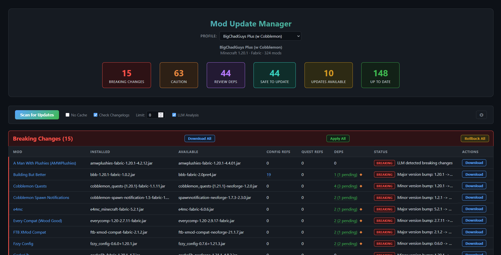
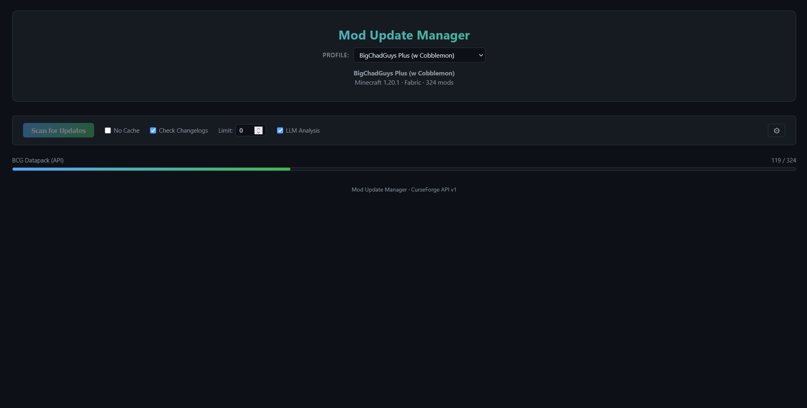
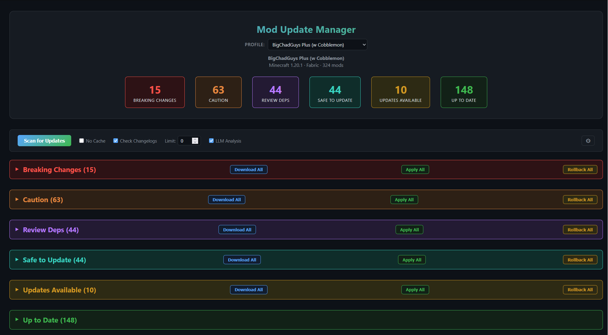
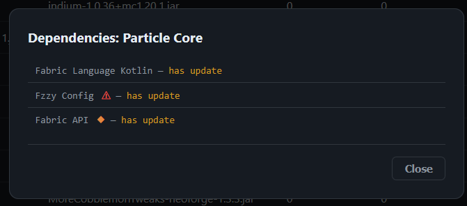
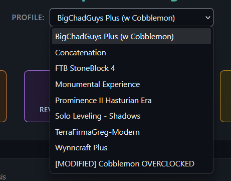
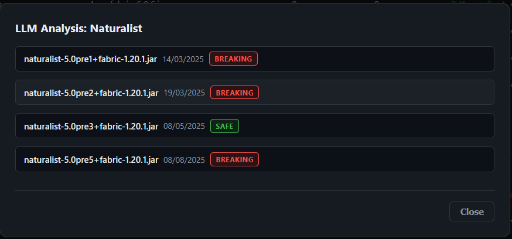
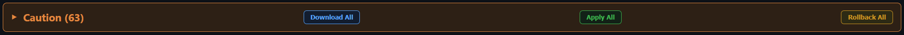
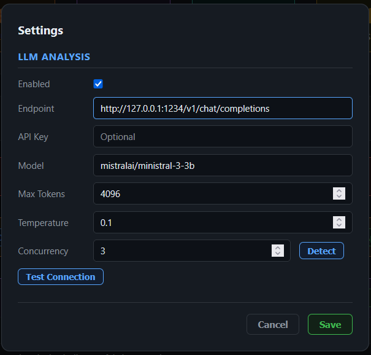

# Minecraft Mod Update Manager

A web-based tool for managing Minecraft mod updates across CurseForge instances. It detects breaking changes through version bump analysis, keyword scanning, and optional LLM-powered changelog analysis. Mods are sorted into actionable categories so you know exactly what needs attention before updating.



## Features

- **Multi-instance support** — Auto-detects all CurseForge instances and lets you switch between profiles
- **Smart categorization** — Sorts mods into 6 buckets: Breaking, Caution, Review Deps, Safe to Update, Updates Available, and Up to Date
- **Config & quest scanning** — Detects which mods are referenced in config files, KubeJS scripts, and quest files (FTB Quests, Better Questing, Heracles)
- **Dependency graph** — Builds a full dependency tree, warns about missing deps, and resolves transitive update chains
- **LLM changelog analysis** — Optional AI-powered analysis that classifies changes as breaking, caution, or safe
- **Keyword fallback** — When LLM is disabled, scans changelogs for breaking change keywords
- **Download, apply & rollback** — Download updates, apply them with automatic backup, and rollback if something goes wrong
- **Real-time progress** — SSE-based live scan progress in the browser

## Quick Start

### Prerequisites

- [Node.js](https://nodejs.org/) 18+
- A [CurseForge](https://www.curseforge.com/) desktop app installation with at least one Minecraft instance

### Installation

```bash
git clone <repo-url>
cd minecraft-mod-updater
npm install
```

### Running

```bash
npm start
```

Open [http://localhost:3000](http://localhost:3000) in your browser.

The app auto-detects CurseForge instances from the default path:
```
~/curseforge/minecraft/Instances
```

## Usage

### Scanning for Updates

1. Select your instance profile from the dropdown
2. Check the options you want:
   - **No Cache** — Force fresh API queries (ignores 24h cache)
   - **Check Changelogs** — Fetch and analyze changelogs for breaking changes
   - **LLM Analysis** — Use AI to classify changelog severity (requires configuration, see below)
   - **Limit** — Scan only the first N mods (useful for testing)
3. Click **Scan for Updates**



### Understanding the Results

After scanning, mods are sorted into 6 categories:



| Category | Color | Meaning |
|----------|-------|---------|
| **Breaking Changes** | Red | LLM detected breaking changes, or version bump/keywords flagged AND config files reference this mod |
| **Caution** | Orange | LLM detected caution-level changes, or version bump/keywords flagged with no config references |
| **Review Deps** | Purple | The mod itself is safe, but one or more of its dependencies are in Breaking or Caution |
| **Safe to Update** | Cyan | LLM confirmed safe — overrides version bump heuristics |
| **Updates Available** | Yellow | Has an update, no flags triggered, no LLM result |
| **Up to Date** | Green | Already on the latest version |

### Dependency Warnings

The **Deps** column shows how many dependencies each mod has. Warning icons appear when dependencies have issues:

- **Red ⚠** — At least one dependency has breaking changes
- **Orange ◆** — At least one dependency requires caution

Click the deps count to open the dependency modal, where each dependency shows its own warning icon.



### Config & Quest References

Click the config refs or quest refs count to see exactly which files reference a mod. This helps you assess the impact of updating — mods referenced in many configs are riskier to update.



### Changelog Analysis

When changelogs are checked, a severity badge appears in the Status column. Click it to view the full LLM analysis or keyword matches for each version between your installed version and the latest.



### Downloading & Applying Updates

Each section has bulk action buttons:

- **Download All** — Downloads all mods in the section (and their dependencies)
- **Apply All** — Replaces old jars with downloaded updates (backs up old files first)
- **Rollback All** — Restores backed-up jars and removes the new ones

You can also download, apply, and rollback individual mods using the per-row buttons.



## LLM Configuration

LLM analysis is optional but significantly improves categorization accuracy. It works with any OpenAI-compatible API endpoint (LM Studio, Ollama, vLLM, OpenAI, etc.).

### Setup via the UI

1. Click the **gear icon** (⚙) in the controls bar
2. Fill in the LLM settings:



| Setting | Description |
|---------|-------------|
| **Enabled** | Toggle LLM analysis on/off |
| **Endpoint** | OpenAI-compatible chat completions URL (e.g., `http://localhost:1234/v1/chat/completions`) |
| **API Key** | Bearer token (optional — leave blank for local servers) |
| **Model** | Model name as reported by your server (e.g., `mistralai/ministral-3-3b`) |
| **Max Tokens** | Maximum tokens per response (default: 1024) |
| **Temperature** | Lower = more deterministic (default: 0.1) |
| **Concurrency** | Number of parallel LLM requests (default: 2) |

3. Click **Test Connection** to verify the endpoint is reachable
4. Click **Detect** next to Concurrency to auto-detect how many model instances your server supports (works with LM Studio's `:N` instance suffixes)
5. Click **Save**

The **LLM Analysis** checkbox in the scan controls will now be enabled.

### Setup via settings.json

You can also edit `settings.json` directly in the project root:

```json
{
  "llm": {
    "enabled": true,
    "endpoint": "http://localhost:1234/v1/chat/completions",
    "apiKey": "",
    "model": "mistralai/ministral-3-3b",
    "maxTokens": 1024,
    "temperature": 0.1,
    "concurrency": 2
  }
}
```

### Recommended LLM Providers

| Provider | Endpoint Example | Notes |
|----------|-----------------|-------|
| **LM Studio** | `http://localhost:1234/v1/chat/completions` | Supports multi-instance concurrency detection |
| **Ollama** | `http://localhost:11434/v1/chat/completions` | Use Ollama's OpenAI-compatible endpoint |
| **OpenAI** | `https://api.openai.com/v1/chat/completions` | Requires API key |
| **Any OpenAI-compatible** | Varies | Must support `/v1/chat/completions` |

A small, fast model (3B–8B parameters) is sufficient — the analysis prompt is concise and structured. Larger models won't significantly improve results but will be slower.

### How LLM Analysis Works

Each changelog is sent to the LLM with a prompt asking it to classify the changes into one of three severity levels:

| Severity | What it means | Examples |
|----------|---------------|---------|
| **Safe** | No risk to existing setups | Bug fixes, performance improvements, new features, translations, cosmetic changes |
| **Caution** | Might affect existing setups | Config format changes, renamed features, deprecations, behavior changes |
| **Breaking** | Will likely break existing setups | Removed items/blocks, deleted features, incompatible world changes, required migrations |

The LLM returns structured JSON with a severity, a 1–2 sentence summary, and a list of specific breaking items. Results are cached alongside changelogs so subsequent scans don't re-analyze.

When LLM severity is available, it takes priority over heuristics:
- **LLM "safe"** overrides version bump detection — if the LLM says it's safe, it goes to Safe to Update even with a major version bump
- **LLM "breaking"** always goes to Breaking Changes regardless of config references
- **LLM "caution"** goes to the Caution bucket

If the LLM fails or is disabled, the system falls back to keyword-based detection.

## How Categorization Works

The classification logic uses multiple signals in priority order:

```
1. LLM severity available?
   ├─ "safe"     → Safe to Update (overrides everything)
   ├─ "caution"  → Caution
   └─ "breaking" → Breaking Changes

2. No LLM, but version bump or breaking keywords found?
   ├─ Config refs > 0 → Breaking Changes
   └─ Config refs = 0 → Caution

3. No flags at all?
   └─ Updates Available

4. After classification:
   └─ Safe mods with deps in Breaking/Caution → Review Deps
```

## Project Structure

```
minecraft-mod-updater/
├── server.js              # Express server & API routes
├── settings.json          # User configuration (LLM settings)
├── package.json
├── lib/
│   ├── config.js          # Constants, paths, keywords, regex
│   ├── scanner.js         # Scan logic & 6-bucket classification
│   ├── curseforge.js      # CurseForge API client (rate-limited)
│   ├── versioning.js      # Semver extraction, version bump detection
│   ├── llm.js             # LLM changelog analysis with concurrency
│   ├── depgraph.js        # Dependency graph & topological sort
│   ├── downloader.js      # Download, apply & rollback operations
│   └── settings.js        # Settings file management
├── public/
│   ├── index.html         # Web UI
│   ├── app.js             # Client-side logic & SSE handling
│   └── style.css          # Dark theme styling
├── docs/
│   └── images/            # Screenshots for documentation
├── downloads/             # Staged mod downloads (auto-created)
├── backups/               # Old mod JARs (auto-created on apply)
└── ModUpdateCache.json    # Scan cache (auto-generated)
```

## API Reference

<details>
<summary>Click to expand API endpoints</summary>

### Instance Management

| Method | Endpoint | Description |
|--------|----------|-------------|
| GET | `/api/instances` | List all detected CurseForge instances |
| GET | `/api/instance` | Get current instance info |
| POST | `/api/instance/select` | Switch to a different instance |

### Scanning

| Method | Endpoint | Description |
|--------|----------|-------------|
| GET | `/api/scan/stream` | Start scan with SSE progress (query params: `noCache`, `checkChangelogs`, `useLlm`, `limit`) |
| GET | `/api/scan/results` | Get last completed scan results |

### References

| Method | Endpoint | Description |
|--------|----------|-------------|
| GET | `/api/config-refs/:addonId` | List config files referencing a mod |
| GET | `/api/quest-refs/:addonId` | List quest files referencing a mod |

### Downloads & Updates

| Method | Endpoint | Description |
|--------|----------|-------------|
| POST | `/api/download` | Download a single mod |
| POST | `/api/download/bulk` | Download multiple mods |
| POST | `/api/apply` | Apply a single update (with backup) |
| POST | `/api/apply/bulk` | Apply multiple updates |
| POST | `/api/rollback` | Rollback a single update |
| POST | `/api/rollback/bulk` | Rollback multiple updates |
| GET | `/api/download-state` | Get download/apply status for all mods |

### Settings

| Method | Endpoint | Description |
|--------|----------|-------------|
| GET | `/api/settings` | Load current settings |
| POST | `/api/settings` | Save settings |
| POST | `/api/settings/test-llm` | Test LLM endpoint connectivity |
| GET | `/api/settings/detect-concurrency` | Detect available model instances |

</details>

## License

MIT
